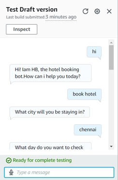
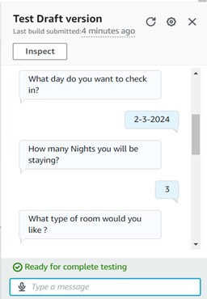
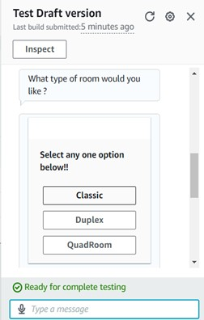
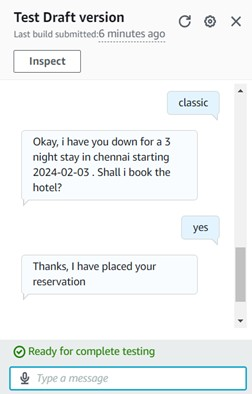

# AWS Lex Hotel Chatbot 🏨🤖

## 📌 Overview
This project is a hotel booking chatbot built using **AWS Lex**, allowing users to:
- Check room availability 🏡
- Make reservations 📝
- Cancel bookings ❌
- Get hotel details ℹ️

---

## 🚀 Features
- **Conversational AI**: Uses AWS Lex for NLP-based interactions.
- **Integration**: Can be integrated with websites and mobile apps.
- **Real-time Booking**: Retrieves room availability dynamically.

---

## 🛠️ Technologies Used
- **AWS Lex** 🤖
- **AWS Lambda** ⚡
- **DynamoDB** 🗄️
- **Kommunicate API** 🔗

---

## 📸 Screenshots

### **Hotel Booking Confirmation**
  
  
  
  

---

## 🔧 How to Set Up
### **1. Clone the Repository**
```bash
git clone https://github.com/bala191103/AWS-Lex-HotelBot.git
cd AWS-Lex-HotelBot
